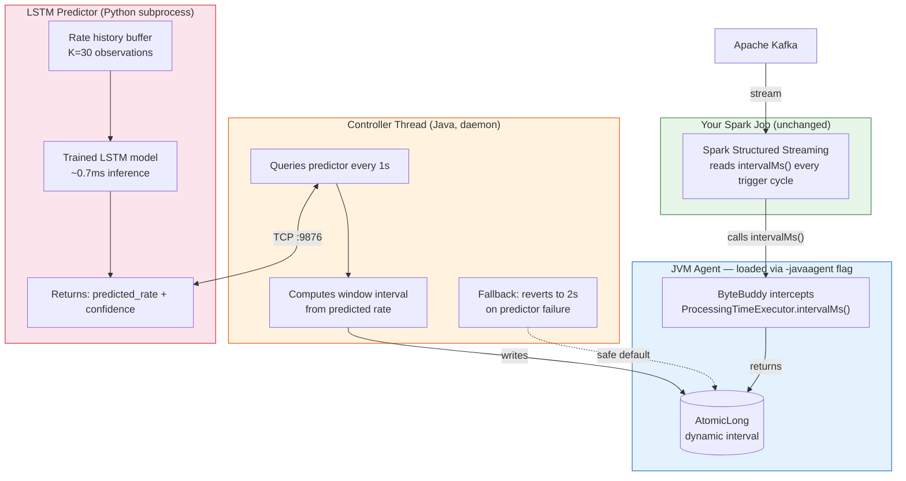
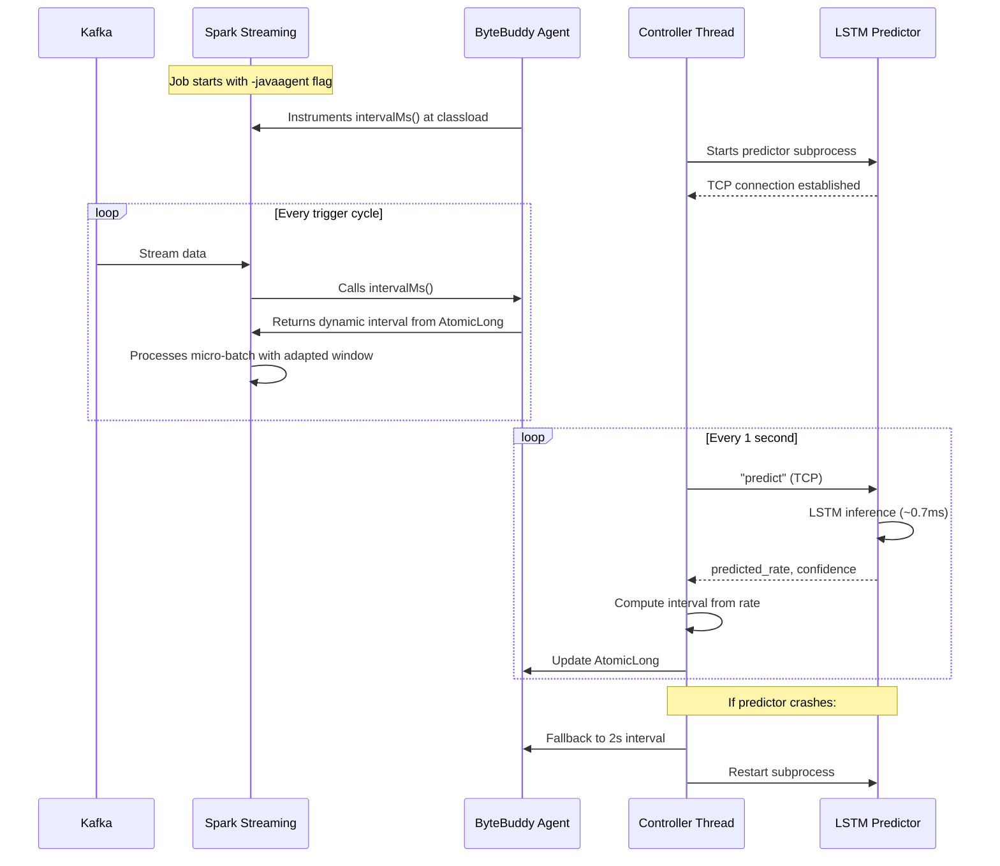

# AdaptiveStream

Capstone project for Big Data Analytics — adaptive windowing for Spark Structured Streaming using bytecode instrumentation and LSTM-based rate prediction.

## What this does

Spark streaming jobs use a fixed trigger interval (e.g. `processingTime="2 seconds"`) that never changes at runtime. This is fine when traffic is steady, but real workloads aren't steady — you get bursts from flash sales, breaking news, incidents, etc. When a burst hits, the fixed window is too large and events pile up. When traffic drops, the window is too small and you're wasting compute on empty micro-batches.

AdaptiveStream fixes this by injecting a JVM agent into Spark that dynamically adjusts the trigger interval based on predicted incoming rates. The agent uses ByteBuddy to intercept `ProcessingTimeExecutor.intervalMs()` at classload time. A background controller thread talks to an LSTM predictor (running as a Python subprocess) over TCP, gets rate forecasts, and updates the interval via an `AtomicLong` that Spark reads on every trigger cycle.

The key thing is this requires **zero changes** to your existing Spark job:

```bash
# before
spark-submit my_job.py

# after — just add the agent flag
spark-submit \
  --conf spark.driver.extraJavaOptions=-javaagent:adaptivestream-agent.jar \
  my_job.py
```

## How it works





## Why LSTM and not just a moving average?

We tested this. With proper training, LSTM beats EMA (exponential moving average) by ~89% MAE overall and ~94% during rate transitions (the moments that actually matter for window sizing). EMA and SMA can only react to recent values — they always lag behind during ramp-ups and ramp-downs. LSTM learns the *shape* of bursts (ramp → hold → ramp-down) from training data and predicts ahead. The full comparison is in `benchmark/`.

## Repo structure

```
agent/                  Java agent (ByteBuddy + controller)
├── pom.xml
└── src/main/java/com/adaptivestream/
    ├── AdaptiveStreamAgent.java       agent entry point (premain)
    ├── IntervalAdvice.java            bytecode advice, overrides intervalMs()
    └── AdaptiveWindowController.java  background thread, IPC, fallback logic

predictor/              LSTM predictor
├── predictor_server.py                TCP server, inference, confidence estimation
└── train.py                           training script (synthetic burst data)

generator/              traffic generator
└── burst_generator.py                 configurable burst patterns → Kafka

baselines/              comparison baselines
├── fixed_baseline.py                  static window (control group)
└── reactive_baseline.py               detect-then-adjust (shows the lag problem)

benchmark/              benchmarking
└── run_benchmark.py                   runs all approaches, collects metrics

models/                 saved model checkpoints (gitignored, train.py regenerates)
dashboard/              live monitoring web app (WIP)
```

## Getting started

You need Java 8+, Maven, Python 3.8+, and a running Kafka broker.

```bash
# 1. build the agent
cd agent
mvn package
# produces target/adaptivestream-agent-1.0.0.jar

# 2. train the LSTM (takes a few minutes, CPU is fine)
cd ../predictor
python3 train.py
# saves to ../models/lstm_predictor.pt

# 3. start Kafka and create a topic
kafka-topics.sh --create --topic adaptive-stream \
  --bootstrap-server localhost:9092 \
  --partitions 2 --replication-factor 1

# 4. generate some bursty traffic
cd ../generator
python3 burst_generator.py --topic adaptive-stream --duration 120 --baseline 100 --burst-mult 8

# 5. run spark with the agent
spark-submit \
  --conf "spark.driver.extraJavaOptions=-javaagent:../agent/target/adaptivestream-agent-1.0.0.jar" \
  --packages org.apache.spark:spark-sql-kafka-0-10_2.12:3.5.4 \
  ../baselines/fixed_baseline.py
```

The agent will start the predictor subprocess automatically, connect to it, and begin adjusting the trigger interval. You'll see `[AdaptiveStream]` and `[Controller]` log lines in the Spark output.

If the predictor crashes or becomes unresponsive, the controller falls back to a safe default interval (2 seconds) and attempts to restart the subprocess.

## Running baselines for comparison

```bash
# fixed window (no adaptation)
spark-submit baselines/fixed_baseline.py "2 seconds" 60

# reactive baseline (adjust after burst detected — has one-window lag)
spark-submit baselines/reactive_baseline.py

# full benchmark suite
cd benchmark
python3 run_benchmark.py
```

## Local development with Docker

If you don't have Kafka installed locally:

```bash
docker-compose up -d    # starts Kafka + Zookeeper
docker-compose down     # stop
```

## Configuration

The controller has a few tunables in `AdaptiveWindowController.java`:

| Parameter | Default | What it does |
|-----------|---------|-------------|
| `UPDATE_PERIOD_MS` | 1000 | How often to query the predictor |
| `MIN_INTERVAL_MS` | 100 | Floor for trigger interval |
| `MAX_INTERVAL_MS` | 30000 | Ceiling for trigger interval |
| `FALLBACK_INTERVAL_MS` | 2000 | Interval used when predictor is down |
| `PREDICTOR_PORT` | 9876 | TCP port for predictor communication |

These will be moved to a config file or CLI args in a future update.

## Tech stack

- **Agent:** Java 8, ByteBuddy 1.14, Maven
- **Predictor:** Python 3, PyTorch, NumPy
- **Streaming:** Apache Spark 3.5 (Structured Streaming)
- **Messaging:** Apache Kafka 3.7
- **IPC:** TCP socket (localhost)
- **Benchmarking:** PySpark, CSV output
- **Local infra:** Docker Compose

## Tested on

- Spark 3.5.4 (confirmed `intervalMs()` is re-read every trigger cycle)
- Kafka 3.7.0
- Java 8 (OpenJDK 1.8.0_482)
- Python 3.12, PyTorch 2.11 (CPU)
- Ubuntu 24.04, 2 cores, 4GB RAM

## Known limitations

- Agent targets `ProcessingTimeExecutor` specifically — other trigger types (continuous processing) are not instrumented
- LSTM predictor needs ~30 seconds of rate history before it starts making useful predictions. During warmup, controller uses fallback interval.
- First inference call after subprocess start takes ~150-200ms (PyTorch JIT warmup). Subsequent calls are <2ms. We run dummy inferences on startup to avoid this.
- Tested on Spark 3.5.4 only. Other versions may have different internal class names — the agent would need the class name updated.

## License

MIT
