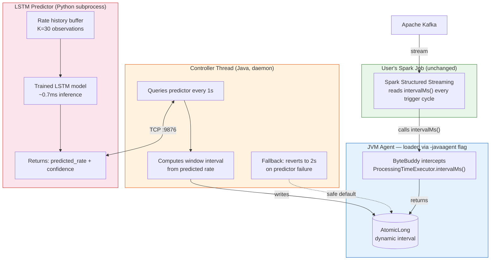
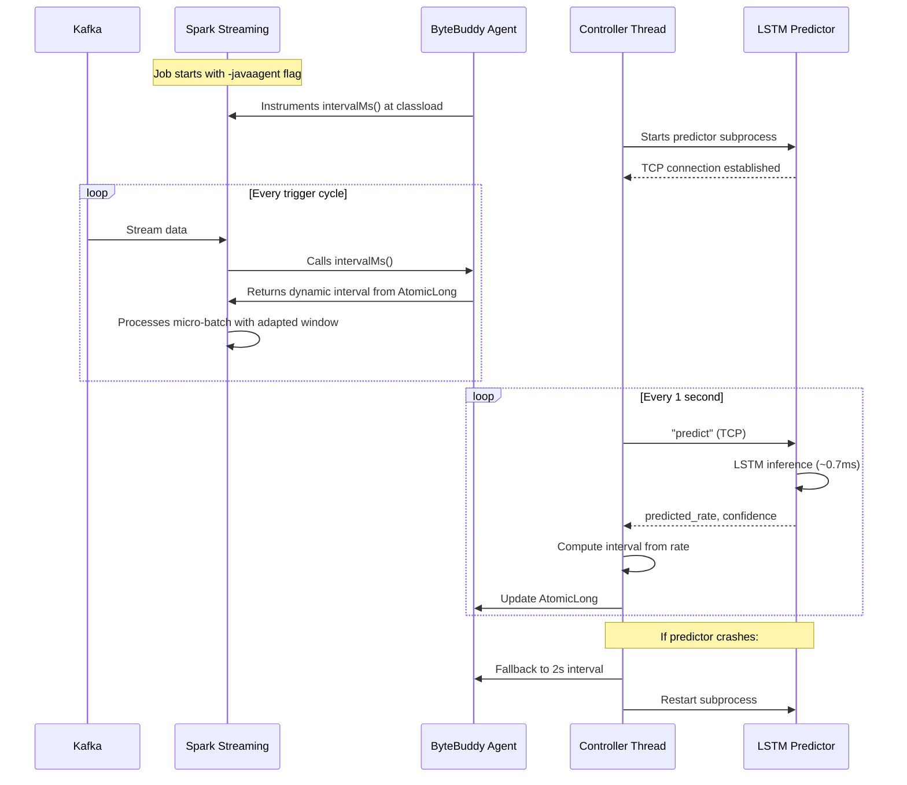

# AdaptiveStream — Project Documentation

**Project Title:** AdaptiveStream — A JVM Agent for Proactive ML-Based Adaptive Windowing in Apache Spark

**Course:** Big Data Analytics — Capstone Project

**Team Size:** 4

**Duration:** 2 Semesters (20 weeks)

**Repository:** https://github.com/AayushBarhate/AdaptiveStream

---

## 1. Problem Statement

### 1.1 Background

Stream processing systems like Apache Spark Structured Streaming process infinite, continuous data by slicing it into finite time-based windows. These windows enable aggregation operations like "count transactions in the last 10 seconds" or "average sensor reading per minute."

Spark supports three window types:

| Type | How it works | Use case |
|------|-------------|----------|
| Tumbling | Fixed, non-overlapping chunks | Hourly billing, periodic reports |
| Sliding | Overlapping chunks (window=10s, slide=5s) | Rolling averages, trend detection |
| Session | Gap-based, closes after inactivity timeout | User session analytics |

All three share one fundamental limitation: **the window size is defined once at job deployment and never changes at runtime.**

### 1.2 The Problem

Real-world data streams are not steady. Traffic patterns are bursty — flash sales, breaking news, server incidents, sporting events all create sudden spikes that can be 5-10x normal throughput.

```
Normal traffic:   ----100msg/s----100msg/s----100msg/s----
Real traffic:     ----100msg/s----950msg/s----80msg/s-----
                                    ↑
                              burst event
```

A fixed window creates a lose-lose situation:
- **Too large during bursts:** events accumulate, processing lags behind, end-to-end latency spikes
- **Too small during quiet periods:** Spark fires many empty or near-empty micro-batches, wasting compute on scheduling overhead

### 1.3 Why Existing Solutions Fall Short

**Reactive adaptation** detects a burst after it arrives and then resizes the window. This always introduces a one-window lag — by the time you react, the damage (latency spike) has already happened.

**Apache Flink's adaptive scaling** adjusts compute parallelism (number of task slots), not window semantics. It solves a different problem — more workers processing the same fixed windows, rather than changing the windows themselves.

**Forking Spark's source code** to add dynamic windowing would work technically, but produces a custom Spark build that nobody else can use without replacing their entire cluster installation. Not practical.

### 1.4 Research Gap

No published work has delivered adaptive windowing for Spark as a non-invasive, drop-in component. Existing approaches either require source modification, pipeline restarts, or full framework migration. The gap is: **can we make Spark's trigger interval dynamic without touching Spark's code?**

---

## 2. Proposed Solution

### 2.1 Overview

AdaptiveStream is a JVM bytecode agent that instruments Apache Spark's trigger execution at classload time using ByteBuddy. It intercepts the method that returns the trigger interval (`ProcessingTimeExecutor.intervalMs()`) and replaces the static return value with a dynamic one controlled by an LSTM-based rate predictor.

From the user's perspective, the integration is one JVM flag:

```bash
# Original job — unchanged
spark-submit my_streaming_job.py

# With AdaptiveStream — one flag added
spark-submit \
  --conf spark.driver.extraJavaOptions=-javaagent:adaptivestream-agent.jar \
  my_streaming_job.py
```

The user's Spark job, cluster configuration, and deployment pipeline remain completely unchanged.

### 2.2 Core Contribution

A non-invasive JVM bytecode agent that instruments Apache Spark Structured Streaming's trigger execution to enable proactive ML-based adaptive windowing — without source modification, pipeline restart, or state loss.

### 2.3 Research Questions

**RQ1:** Can a JVM bytecode agent instrument Spark's trigger execution to enable dynamic window sizing without pipeline restart or state loss?

**RQ2:** Does LSTM-based proactive window prediction reduce peak end-to-end latency compared to reactive and fixed baselines under bursty Kafka workloads?

**RQ3:** How does AdaptiveStream compare to Apache Flink's native adaptive streaming in latency, throughput, and operational complexity across identical workloads?

---

## 3. Architecture

### 3.1 System Overview



### 3.2 Runtime Sequence



### 3.3 Component Details

#### 3.3.1 JVM Agent (`AdaptiveStreamAgent.java`)

The agent entry point. Loaded via Java's `-javaagent` mechanism before any application class. Uses ByteBuddy to register bytecode advice on `ProcessingTimeExecutor.intervalMs()`.

```java
public class AdaptiveStreamAgent {
    public static void premain(String args, Instrumentation inst) {
        AdaptiveWindowController.start();
        new AgentBuilder.Default()
            .type(named("org.apache.spark.sql.execution.streaming.ProcessingTimeExecutor"))
            .transform(new AgentBuilder.Transformer.ForAdvice()
                .advice(named("intervalMs"), "com.adaptivestream.IntervalAdvice"))
            .installOn(inst);
    }
}
```

Spark's original code reads `intervalMs` as a static value set once at job start:

```scala
// Spark source — ProcessingTimeExecutor.scala
val intervalMs: Long = trigger.intervalMs  // read once, used every cycle
```

The agent's `IntervalAdvice` intercepts the return value and replaces it with whatever the controller has written to the shared `AtomicLong`:

```java
public class IntervalAdvice {
    @Advice.OnMethodExit
    public static void onExit(@Advice.Return(readOnly = false) long returnValue) {
        long override = AdaptiveWindowController.getCurrentIntervalMs();
        if (override > 0) {
            returnValue = override;
        }
    }
}
```

#### 3.3.2 Controller (`AdaptiveWindowController.java`)

A daemon thread running inside the Spark driver JVM. Responsibilities:
- Start and manage the Python predictor subprocess
- Query the predictor every second via TCP
- Parse the predicted rate and confidence score
- Compute the target interval using a confidence-weighted formula
- Smooth the interval transition via `IntervalSmoother`
- Write the final interval to the `AtomicLong` that Spark reads
- Handle predictor failures: fallback to safe interval, attempt restart

**Interval computation formula:**

```
raw_interval = TARGET_EVENTS_PER_WINDOW / predicted_rate
blended = confidence * raw_interval + (1 - confidence) * FALLBACK_INTERVAL
final = IntervalSmoother.smooth(clamp(blended, MIN, MAX))
```

Where:
- `TARGET_EVENTS_PER_WINDOW = 1000` — aim for ~1000 events per micro-batch
- `FALLBACK_INTERVAL = 2000ms` — safe default when confidence is low
- `MIN = 100ms`, `MAX = 30000ms` — operational bounds
- Confidence weighting ensures uncertain predictions don't cause erratic interval changes

#### 3.3.3 Interval Smoother (`IntervalSmoother.java`)

Prevents sudden interval changes that could corrupt Spark's internal state (watermarks, buffered events).

Constraints:
- Maximum shrink: 50% per update cycle (interval can at most halve)
- Maximum expand: 200% per update cycle (interval can at most double)
- EMA smoothing with alpha=0.3 on top of rate limiting
- Hard floor at 100ms, hard ceiling at 30s

This means a transition from 10s to 500ms takes several cycles (~8-10 seconds) rather than happening instantly. Spark's state store has time to adapt.

#### 3.3.4 LSTM Predictor (`predictor_server.py`)

A Python process communicating with the Java controller via TCP socket on `localhost:9876`.

**Model architecture:**
- LSTM with 2 layers, 64 hidden units, dropout=0.2
- Input: K=30 normalized rate observations
- Output: predicted next rate (single value)
- Per-series normalization: `(x - mean) / std` on input, denormalize on output

**Confidence estimation:**
- MC Dropout: run 10 forward passes with dropout enabled
- Measure prediction variance across passes
- High variance → low confidence → controller blends toward fallback interval

**Metrics collection:**
- `SparkMetricsCollector` polls Spark's REST API at `:4040` every second
- Extracts `inputRowsPerSecond` from `StreamingQueryProgress`
- Maintains a sliding window of K=30 rate observations
- Falls back to manual rate injection for testing

**Warmup:**
- 10 dummy inferences on startup to trigger PyTorch JIT compilation
- Avoids ~178ms cold-start latency on first real prediction

#### 3.3.5 Burst Generator (`burst_generator.py`)

Generates synthetic Kafka traffic with controllable burst patterns for training and testing.

Parameters:
- `baseline_rate`: steady-state messages per second (default: 100)
- `burst_mult`: spike multiplier (default: 8x)
- `burst_prob`: probability of burst starting each second (default: 0.1)
- `burst_duration`: length of each burst in seconds (default: 30)
- `noise_std`: random jitter on rates (default: 10)

Burst shape: ramp-up → hold → ramp-down (realistic, not square wave)

---

## 4. Tech Stack

| Layer | Tool | Version | Why |
|-------|------|---------|-----|
| Message broker | Apache Kafka | 3.7.0 | Industry standard, creates the velocity problem we're solving |
| Stream processor | Apache Spark | 3.5.4 (unmodified) | Target of instrumentation |
| Agent framework | ByteBuddy | 1.14.12 | Same library used by OpenTelemetry, Datadog — production-proven |
| ML model | PyTorch LSTM | 2.11.0 (CPU) | Best temporal dependency capture for bursty time series |
| IPC | TCP socket | — | Sub-millisecond localhost communication |
| Comparison baseline | Apache Flink | 1.18 (PyFlink) | State-of-the-art comparison target |
| Local infra | Docker Compose | — | Single-command Kafka + ZooKeeper |
| Cloud infra | AWS EMR | m5.xlarge x3 | Scale benchmarking (planned) |
| Build system | Maven | 3.8.7 | Standard JVM agent toolchain |
| Languages | Java 8 (agent) + Python 3.12 (ML) | — | JVM interop + ML ecosystem |
| Testing | JUnit 4 | 4.13.2 | Agent unit tests |

---

## 5. Datasets

### 5.1 Training — Synthetic Generator

Fully synthetic burst time series generated by `generator/burst_generator.py`. We train exclusively on synthetic data so we have full control over burst shape, intensity, and frequency. Training on 100 series with varied parameters, 30 epochs, per-series normalization.

### 5.2 Evaluation Dataset 1 — NYC Taxi Trip Dataset

- **Source:** NYC TLC Trip Record Data (https://www.nyc.gov/site/tlc/about/tlc-trip-record-data.page)
- **Size:** ~1GB per month of timestamped taxi trip events
- **Usage:** Replay events by `tpep_pickup_datetime` at real-time rates into Kafka
- **Why:** Real temporal clustering (rush hours, event nights) creates organic burst patterns not present in training data
- **Planned size:** 3 months (~3GB) for statistically significant evaluation

### 5.3 Evaluation Dataset 2 — Wikipedia EventStreams

- **Source:** `https://stream.wikimedia.org/v2/stream/recentchange` (live public SSE stream)
- **Why:** Completely different domain — breaking news causes Wikipedia edit spikes unlike anything in taxi data
- **Tests:** Cross-domain generalization of the LSTM trained on synthetic data

---

## 6. Baselines

| Approach | Description | What it tests |
|----------|------------|---------------|
| **Fixed window (2s)** | Static 2-second trigger interval, no adaptation | Control group — standard Spark behavior |
| **Fixed window (500ms)** | Static 500ms trigger interval | Shows what happens if you over-provision for bursts (wasted compute during quiet) |
| **Reactive** | Monitor per-batch rate, adjust interval after burst detected | Demonstrates the one-window-lag problem |
| **Apache Flink** | Equivalent pipeline in Flink 1.18 (PyFlink), same Kafka topic, same aggregation | State-of-the-art comparison |
| **EMA** | Exponential moving average rate prediction (alpha=0.3) | Simpler ML-free baseline |
| **SMA** | Simple 10-point moving average rate prediction | Simplest possible baseline |

Fairness guarantees for Flink comparison:
1. Same Kafka topic and data
2. Same parallelism (2)
3. Same aggregation logic (count per window)
4. Same latency metric (producer_ts → processing_ts)
5. Same output format (JSON per-event latency)

---

## 7. Evaluation Metrics

| Metric | How measured | Target |
|--------|-------------|--------|
| End-to-end latency (p50, p95, p99) | `producer_timestamp → Spark output timestamp` per event | AdaptiveStream < Reactive < Fixed during bursts |
| Throughput | Events processed per second | No regression vs fixed baseline |
| LSTM prediction MAE | Mean absolute error on rate forecast (holdout set) | Below 15% of baseline rate |
| Agent instrumentation overhead | Median batch duration increase | Below 10% |
| Memory overhead | Peak RSS delta (vanilla vs agent) | Documented, not a pass/fail |
| LSTM inference latency | Time per forward pass (p99) | Below 5ms |
| IPC roundtrip | TCP socket request → response time | Below 3ms |
| Fallback trigger rate | % of windows entering fallback mode | Below 5% on known patterns |
| Smoother convergence time | Cycles to reach within 10% of target interval | Below 15 cycles |

---

## 8. Feasibility Testing Results

All core technical assumptions were tested on a GCP VM (2 cores, 3.8GB RAM, Ubuntu 24.04) before full implementation. Raw outputs in `results/raw/`, analysis in `results/infer.md`.

| # | Test | Result | Key finding |
|---|------|--------|-------------|
| 1 | ByteBuddy intercepts `intervalMs()` | PASS | Spark re-reads the method every trigger cycle — NOT cached |
| 2 | Dynamic interval override at runtime | PASS | AtomicLong written by controller, read by Spark trigger thread |
| 3 | LSTM inference speed (CPU) | PASS | 0.67ms mean, 1.03ms p99 — negligible |
| 4 | Kafka → Spark Structured Streaming | PASS | 280 messages with burst pattern, all received correctly |
| 5 | TCP socket IPC roundtrip | PASS | 1.2ms after warmup, <0.3ms socket overhead |
| 6 | LSTM vs EMA vs SMA | PASS | LSTM beats EMA by 89% overall, 94% during transitions |
| 7 | Resource overhead (agent) | PASS | +7.6% median batch latency, +47% memory (82MB) |
| E2E | Full integration test | PASS | Agent → Controller → Predictor → Spark, auto-start, clean shutdown |
| Unit | 14 JUnit tests | PASS | IntervalSmoother + Controller logic, all passing |

### LSTM vs Baselines (detailed)

```
=== ALL TRAFFIC [5380 samples] ===
Method        MAE     Median      p95
LSTM        13.33       9.86    36.85
SMA        201.82     205.98   414.23     LSTM 93.4% better
EMA        121.35     118.75   248.84     LSTM 89.0% better

=== BURST REGIONS [3771 samples] ===
LSTM        10.86       8.88    27.75
SMA        206.64     213.12   406.75     LSTM 94.7% better
EMA        131.19     140.66   246.02     LSTM 91.7% better

=== TRANSITIONS [2598 samples] ===
LSTM        11.26       9.02    28.86
SMA        307.63     341.47   422.90     LSTM 96.3% better
EMA        200.11     210.15   254.58     LSTM 94.4% better
```

### Resource Overhead

```
                Vanilla Spark    Spark + Agent    Delta
Median(ms)      1125.0           1211.0           +7.6%
p95(ms)         2066.5           4400.0           +113% (startup cost)
Peak RSS        173 MB           255 MB           +82 MB (+47%)
```

---

## 9. Repository Structure

```
adaptivestream/
├── agent/                              Java bytecode agent
│   ├── pom.xml                         Maven build (ByteBuddy + JUnit)
│   └── src/
│       ├── main/java/com/adaptivestream/
│       │   ├── AdaptiveStreamAgent.java        Agent entry point (premain)
│       │   ├── IntervalAdvice.java             Bytecode advice for intervalMs()
│       │   ├── AdaptiveWindowController.java   Controller thread + IPC + fallback
│       │   └── IntervalSmoother.java           Rate-limited interval transitions
│       └── test/java/com/adaptivestream/
│           ├── IntervalSmootherTest.java        7 tests: convergence, bounds, reset
│           └── ControllerTest.java              7 tests: formula, confidence, edges
│
├── predictor/                          LSTM prediction server
│   ├── predictor_server.py             TCP server, inference, confidence estimation
│   ├── train.py                        Training script (synthetic burst data)
│   └── metrics_collector.py            Spark REST API rate collector
│
├── generator/                          Traffic generator
│   └── burst_generator.py             Configurable burst patterns → Kafka
│
├── baselines/                          Comparison baselines
│   ├── fixed_baseline.py              Static window (control)
│   └── reactive_baseline.py           Detect-then-adjust (shows lag problem)
│
├── flink/                              Flink comparison
│   ├── flink_baseline.py              Equivalent PyFlink pipeline
│   └── README.md                      Fairness guarantees
│
├── benchmark/                          Benchmarking
│   ├── run_benchmark.py               Runs all approaches, collects metrics
│   └── latency/
│       ├── latency_benchmark.py       Per-event latency measurement
│       └── run_latency_test.sh        Full benchmark script
│
├── results/                            Test outputs
│   ├── infer.md                       Analysis and takeaways
│   └── raw/                           Raw outputs from all 9 tests
│
├── models/                             Saved checkpoints (gitignored)
│   └── lstm_predictor.pt             Trained model (reproducible via train.py)
│
├── docker-compose.yml                 Kafka + ZooKeeper local setup
├── requirements.txt                   Pinned Python dependencies
├── README.md                          Project overview and setup guide
└── project.md                         This file
```

---

## 10. Implementation Timeline

### Completed Work (Pre-Semester 1)

- Agent JAR built and tested on Spark 3.5.4
- `intervalMs()` intercept proven — Spark re-reads every cycle
- LSTM trained on 100 synthetic series, model saved
- LSTM vs EMA/SMA benchmarked (LSTM wins by 89-94%)
- Predictor server with TCP IPC, health checks, confidence estimation
- Controller with subprocess management, reconnect, fallback mode
- IntervalSmoother with rate limiting and EMA smoothing
- Burst generator with configurable patterns
- Fixed and reactive baselines
- Flink baseline pipeline (PyFlink)
- Latency benchmark pipeline (per-event measurement)
- Spark REST API metrics collector
- 14 unit tests, all passing
- GitHub repo with CI-ready structure

### Semester 1 (10 weeks)

| Week | Agent/Controller | Data Pipeline | LSTM/ML | Flink/Benchmarks |
|------|-----------------|---------------|---------|-----------------|
| 1-2 | Agent packaging, CLI args for tunables | Kafka topic setup, NYC Taxi data download and replayer | Hyperparameter tuning, train on 1000+ series | Wire PyFlink to Kafka, validate output parity with Spark |
| 3-4 | Integration testing, edge cases (Spark restart, OOM, long runs) | Generator → Kafka → Spark pipeline end-to-end | NYC Taxi cross-domain evaluation | Flink latency instrumentation, validate fairness |
| 5-6 | Spark version compatibility (3.4, 3.5) | End-to-end: generator → Kafka → Spark → latency CSV | EMA/SMA/ARIMA baselines for paper comparison | End-to-end: generator → Kafka → Flink → latency CSV |
| 7-8 | Polish, documentation | Full latency benchmark runs (all approaches) | ARIMA baseline, prediction error analysis | Benchmark all approaches on same workload |
| 9-10 | Semester 1 report | Semester 1 report | Semester 1 report | Preliminary Spark vs Flink comparison |

### Semester 2 (10 weeks)

| Week | Focus |
|------|-------|
| 1-2 | Scale experiments on AWS EMR (m5.xlarge x3), 50GB+ data, 60 benchmark runs |
| 3-4 | Wikipedia EventStream generalization test + RL baseline (stable-baselines3) |
| 5-6 | Multi-objective optimization: latency vs event completeness Pareto front |
| 7 | Formal probabilistic latency bounds, Wilcoxon signed-rank tests |
| 8 | Live monitoring dashboard (Flask + Chart.js, 1 week) |
| 9-10 | Paper writing (IEEE format, 10-12 pages), capstone report, live demo |

---

## 11. Novelty Contributions

### 11.1 Non-invasive adaptive windowing via bytecode instrumentation

No published work has delivered adaptive windowing as a Spark instrumentation agent. Existing approaches require source modification or pipeline migration. AdaptiveStream is the first drop-in solution.

### 11.2 Multi-objective window optimization (planned)

Current system optimizes for latency only. We plan to frame window sizing as a multi-objective optimization problem balancing latency and event completeness (Pareto front). No published work addresses this trade-off for ML-based window adaptation.

### 11.3 Transfer learning across stream topologies (planned)

Pre-train LSTM on synthetic data, fine-tune on 5 minutes of live data from any new stream. "Few-shot adaptive windowing" — practical and novel.

### 11.4 Formal latency bounds (planned)

Probabilistic guarantees: "with 95% confidence, latency stays below X during bursts of magnitude Y." No existing ML-based window adaptation system provides formal bounds.

### 11.5 RL comparison (planned)

Reinforcement learning for adaptive windowing (reward = low latency, action = window size) is unexplored in literature. Comparing LSTM vs RL is a publishable finding regardless of which wins.

---

## 12. Potential Questions and Defenses

| Question | Answer |
|----------|--------|
| Why not just use Flink? | Flink requires full pipeline migration. AdaptiveStream works on existing Spark deployments with one flag. We empirically compare both. |
| Is bytecode instrumentation safe? | Yes. OpenTelemetry, Datadog, and New Relic all ship production JVM agents built on ByteBuddy. Standard pattern. |
| What if LSTM predicts wrong? | Confidence-weighted blending pushes uncertain predictions toward safe fallback. IntervalSmoother prevents sudden jumps. Controller auto-restarts crashed predictors. |
| Why not just use EMA? | Tested it. LSTM beats EMA by 89% overall and 94% during transitions. EMA has no memory of burst shapes — it always lags during ramp-ups. |
| What about Spark AQE? | AQE optimizes batch query execution plans (logical/physical level). It has no effect on Structured Streaming trigger intervals. Orthogonal systems. |
| What's the overhead? | 7.6% median batch latency, 82MB memory. Measured and documented. |
| Does this work on other Spark versions? | Tested on 3.5.4. Agent targets a specific internal class — version compatibility testing is planned for 3.4. Architecture allows retargeting by changing one class name. |

---

## 13. Deliverables

| Deliverable | Format | Status |
|-------------|--------|--------|
| `adaptivestream-agent.jar` | Executable JVM agent | Done — built and tested |
| Full source code | GitHub monorepo | Done — https://github.com/AayushBarhate/AdaptiveStream |
| Trained LSTM model | PyTorch checkpoint | Done — reproducible via `train.py` |
| Feasibility test results | Raw outputs + analysis | Done — `results/` |
| Unit tests | 14 JUnit tests | Done — all passing |
| Latency benchmark framework | PySpark + shell scripts | Done — `benchmark/latency/` |
| Flink comparison pipeline | PyFlink | Done — `flink/` |
| Docker Compose setup | YAML | Done — `docker-compose.yml` |
| NYC Taxi evaluation | Latency CDFs + comparison plots | Planned — Semester 1 |
| AWS EMR scale benchmarks | Raw CSVs + publication plots | Planned — Semester 2 |
| Live dashboard | Flask + Chart.js | Planned — Semester 2 |
| Capstone report | IEEE format, 10-12 pages | Planned — Semester 2 |
| Conference paper draft | Targeting IEEE BigData 2026 or ACM DEBS 2026 | Planned — Semester 2 |

---

## 14. References

1. M. Zaharia et al., "Structured Streaming: A Declarative API for Real-Time Applications in Apache Spark," SIGMOD 2018
2. P. Carbone et al., "Apache Flink: Stream and Batch Processing in a Single Engine," IEEE Data Eng. Bull. 2015
3. R. Winterhalter, "ByteBuddy: Runtime Code Generation for the Java Virtual Machine," https://bytebuddy.net
4. S. Hochreiter and J. Schmidhuber, "Long Short-Term Memory," Neural Computation, 1997
5. Y. Gal and Z. Ghahramani, "Dropout as a Bayesian Approximation," ICML 2016 (MC Dropout confidence)
6. OpenTelemetry Java Agent — https://github.com/open-telemetry/opentelemetry-java-instrumentation (production ByteBuddy agent reference)
